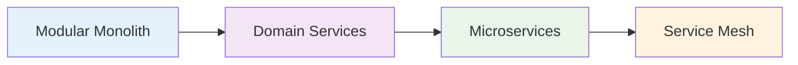

# Multi-Module Spring Boot Architecture Strategy

## Overview

This document presents a proven modularization strategy for Java/Spring Boot projects that implements clean architecture principles with clear separation of concerns. The approach is designed to be scalable, maintainable, and applicable across different business domains.

## Core Architecture Pattern

The strategy follows a **Multi-Module Hexagonal Architecture** with five distinct modules:

```
{project-name}/
├── {domain}-spec/         # 📋 Domain Contracts & Models
├── {domain}-aggregate/    # 🏗️  Business Logic & Data Access
├── {domain}-rest/         # 🌐 REST APIs & Event Handling
├── {domain}-client/       # 🔌 External Integration Client
└── {domain}-boot/         # 🚀 Application Bootstrap
```

**Key Benefits:**

- **Dependency Inversion**: Higher-level modules don't depend on lower-level details
- **Single Responsibility**: Each module has a clear, focused purpose
- **Independent Deployment**: Modules can be tested and deployed separately
- **Team Scalability**: Different teams can work on different modules

## Module Breakdown

### 1. **{domain}-spec** - Domain Contracts Module 📋

**Purpose**: Defines the pure domain model, business contracts, and data transfer objects without any implementation details.

**Key Components**:

```
{domain}-spec/
├── entity/          # Core domain entities
├── facade/          # Service interfaces & DTOs
│   └── sdo/         # Service Data Objects
├── event/           # Domain events for decoupling
├── exception/       # Business-specific exceptions
└── vo/              # Immutable value objects
```

**Dependencies**: Minimal (avoid Spring Boot starters, use only essential annotations)

**✅ Best Practices**:

- **Pure Domain Logic**: No infrastructure concerns or implementation details
- **Shared Contracts**: Used by all other modules as the single source of truth
- **Immutable Objects**: Prefer immutable DTOs and value objects
- **Clear Boundaries**: Each subdomain has its own package structure

### 2. **{domain}-aggregate** - Business Logic & Data Module 🏗️

**Purpose**: Implements all business logic, data persistence, and orchestrates complex workflows.

**Key Components**:

```
{domain}-aggregate/
├── {subdomain}/
│   ├── logic/       # Business logic implementations
│   │   ├── *Logic.java      # Command operations (Create, Update, Delete)
│   │   └── *QueryLogic.java # Query operations (Read, Search)
│   └── store/       # Data access layer
│       ├── *Store.java      # Data access facade
│       ├── jpo/             # JPA Persistence Objects
│       ├── repository/      # Spring Data repositories
│       └── projection/      # Query projections
├── flow/            # Complex business workflows
├── proxy/           # External service integration
└── config/          # Persistence & infrastructure config
```

**Dependencies**: {domain}-spec, Spring Data JPA, QueryDSL

**✅ Best Practices**:

- **CQRS Pattern**: Separate read (Query) and write (Command) operations
- **Repository Pattern**: Abstract data access behind repositories
- **Store Pattern**: Group related data operations in store classes
- **Flow Pattern**: Orchestrate complex multi-step business processes

### 3. **{domain}-rest** - API & Event Processing Module 🌐

**Purpose**: Exposes REST APIs and handles external events, serving as the application's presentation layer.

**Key Components**:

```
{domain}-rest/
├── rest/
│   ├── {subdomain}/
│   │   ├── *Resource.java      # Public API endpoints
│   │   └── *AdminResource.java # Administrative endpoints
├── event/
│   ├── consumer/    # Event consumers (Kafka, RabbitMQ)
│   └── producer/    # Event publishers
└── config/          # Web & messaging configuration
```

**Dependencies**: {domain}-aggregate, Spring Web, Spring Cloud Stream

**✅ Best Practices**:

- **Facade Implementation**: Controllers implement interfaces from {domain}-spec
- **Domain Organization**: Group endpoints by business subdomain
- **Separation of Concerns**: Separate public and admin APIs
- **Event-Driven**: Handle external events for loose coupling
- **Stateless Design**: Controllers delegate all business logic to aggregate layer

### 4. **{domain}-client** - External Integration Client Module 🔌

**Purpose**: Provides a reusable client library for external applications to integrate with your domain APIs.

**Key Components**:

```
{domain}-client/
├── client/
│   ├── *Client.java         # Typed API clients
│   └── *ClientImpl.java     # WebClient implementations
├── config/
│   └── *WebClientConfig.java # Client configuration
└── exception/               # Client-specific exceptions
```

**Dependencies**: {domain}-spec, Spring WebFlux (for reactive clients)

**✅ Best Practices**:

- **Reactive Programming**: Use WebClient for non-blocking I/O
- **Reusable Library**: Can be published as a separate JAR for external teams
- **Type Safety**: Use spec module DTOs for compile-time safety
- **Configuration Flexibility**: Support different environments and authentication
- **Circuit Breaker**: Implement resilience patterns for external calls

### 5. **{domain}-boot** - Application Bootstrap Module 🚀

**Purpose**: Application entry point, runtime configuration, and deployment artifacts.

**Key Components**:

```
{domain}-boot/
├── *BootApplication.java    # Main Spring Boot application
├── config/
│   ├── WebConfig.java       # Web layer configuration
│   └── *ExceptionHandler.java # Global exception handling
└── resources/
    ├── application.yml      # Base configuration
    ├── application-{env}.yml # Environment-specific config
    └── static/              # Static web resources
```

**Dependencies**: {domain}-rest, Spring Boot starters

**✅ Best Practices**:

- **Minimal Bootstrap**: Keep the main class simple and focused
- **Environment Configuration**: Support multiple deployment environments
- **Global Exception Handling**: Centralized error handling and response formatting
- **Security Configuration**: Authentication and authorization setup
- **Monitoring Integration**: Health checks, metrics, and observability

## Architectural Principles & Design Patterns

### 1. **Dependency Flow & Module Relationships**

```mermaid
graph TD
    A[{domain}-boot] --> B[{domain}-rest]
    B --> C[{domain}-aggregate]
    C --> D[{domain}-spec]
    E[{domain}-client] --> D

    style D fill:#e1f5fe
    style C fill:#f3e5f5
    style B fill:#e8f5e8
    style E fill:#fff3e0
    style A fill:#ffebee
```

**Dependency Rules:**

- ✅ Inner modules can be imported by outer modules
- ❌ Inner modules must NOT depend on outer modules
- ✅ All modules can depend on the spec module
- ✅ Client module is independent and only depends on spec

### 2. **Hexagonal Architecture Layers**

| Layer              | Module                         | Responsibility                        | Dependencies            |
| ------------------ | ------------------------------ | ------------------------------------- | ----------------------- |
| **Domain**         | {domain}-spec                  | Business rules, entities, contracts   | Minimal (no frameworks) |
| **Application**    | {domain}-aggregate             | Use cases, business logic             | Domain + Infrastructure |
| **Infrastructure** | {domain}-rest, {domain}-client | External interfaces, data persistence | Application + Domain    |
| **Configuration**  | {domain}-boot                  | Application assembly, runtime config  | All layers              |

### 3. **Domain-Driven Design (DDD) Implementation**

**Aggregate Design:**

- Each subdomain represents a bounded context
- Clear aggregate boundaries prevent tight coupling
- Domain events enable communication between aggregates

**Strategic Patterns:**

- **Bounded Context**: Each module represents a distinct business area
- **Shared Kernel**: Common domain concepts in the spec module
- **Anti-Corruption Layer**: Proxy classes protect domain from external systems

### 4. **Naming Conventions & Patterns**

#### Data Transfer Objects (DTOs)

| Pattern | Purpose                                    | Layer             | Example                    |
| ------- | ------------------------------------------ | ----------------- | -------------------------- |
| `*Jpo`  | **J**PA **P**ersistence **O**bjects        | Aggregate (Store) | `{{domain}}Jpo.java`       |
| `*Sdo`  | **S**ervice **D**ata **O**bjects (Input)   | Spec (Facade)     | `{{domain}}Sdo.java`       |
| `*Rdo`  | **R**esponse **D**ata **O**bjects (Output) | Spec (Facade)     | `{{domain}}Rdo.java`       |
| `*Qdo`  | **Q**uery **D**ata **O**bjects (Search)    | Spec (Facade)     | `{{domain}}Qdo.java`       |
| `*Cdo`  | **C**ommand **D**ata **O**bjects (Actions) | Spec (Facade)     | `{{domain}}RejectCdo.java` |

#### Service & Component Classes

| Pattern       | Purpose                       | Layer     | Example                     |
| ------------- | ----------------------------- | --------- | --------------------------- |
| `*Logic`      | Business logic implementation | Aggregate | `{{domain}}Logic.java`      |
| `*QueryLogic` | Read-only query operations    | Aggregate | `{{domain}}QueryLogic.java` |
| `*Store`      | Data access orchestration     | Aggregate | `{{domain}}Store.java`      |
| `*Flow`       | Complex business workflows    | Aggregate | `{{domain}}Flow.java`       |
| `*Proxy`      | External service integration  | Aggregate | `UserProxy.java`            |
| `*Resource`   | REST API controllers          | Rest      | `{{domain}}Resource.java`   |
| `*Client`     | External API clients          | Client    | `{{domain}}Client.java`     |

#### Package Organization

```
{domain}-{module}/
└── src/main/java/{company}/{domain}/{module}/
    ├── {subdomain1}/          # Business subdomain
    │   ├── logic/
    │   ├── store/
    │   └── ...
    ├── {subdomain2}/
    └── shared/                # Cross-subdomain utilities
```

### 5. **Configuration & Build Management**

#### Multi-Environment Configuration

```yaml
# application.yml (base configuration)
spring:
  application:
    name: {domain}-service
  profiles:
    active: local

---
# application-local.yml
spring:
  config:
    activate:
      on-profile: local
  datasource:
    url: jdbc:h2:mem:testdb

---
# application-prod.yml
spring:
  config:
    activate:
      on-profile: prod
  datasource:
    url: ${DB_URL}
```

#### Gradle Multi-Module Setup

```gradle
// settings.gradle
rootProject.name = '{domain}-service'
include '{domain}-spec'
include '{domain}-aggregate'
include '{domain}-rest'
include '{domain}-client'
include '{domain}-boot'

// build.gradle (root)
subprojects {
    apply plugin: 'java-library'
    apply plugin: 'org.springframework.boot'

    dependencies {
        // Shared dependencies
        implementation 'org.springframework.boot:spring-boot-starter'
        testImplementation 'org.springframework.boot:spring-boot-starter-test'
    }
}
```

## Benefits & Value Proposition

### 🛠️ **Development & Maintenance Benefits**

| Benefit                  | Description                                              | Impact                                      |
| ------------------------ | -------------------------------------------------------- | ------------------------------------------- |
| **Clear Separation**     | Each module has single responsibility                    | ✅ Easier debugging and feature development |
| **Reduced Coupling**     | Modules interact through well-defined interfaces         | ✅ Changes in one module don't break others |
| **Code Discoverability** | Consistent structure and naming conventions              | ✅ New team members onboard faster          |
| **Refactoring Safety**   | Strong module boundaries prevent accidental dependencies | ✅ Confident code improvements              |

### 🧪 **Testing & Quality Benefits**

- **Unit Testing**: Test business logic in isolation without infrastructure
- **Integration Testing**: Test each module's external contracts independently
- **Mock-Friendly**: Clear interfaces make mocking external dependencies easy
- **Test Pyramid**: Support proper test distribution (unit > integration > e2e)

### 🚀 **Scalability & Team Benefits**

- **Team Autonomy**: Different teams can own different modules
- **Parallel Development**: Teams can work simultaneously without conflicts
- **Independent Deployment**: Deploy modules separately (microservices evolution)
- **Domain Expertise**: Team specialization around business domains

### 🔄 **Reusability & Integration Benefits**

- **API Client**: External teams can integrate using the client module
- **Cross-Project Sharing**: Spec module can be shared across related projects
- **Multi-Interface Support**: Same business logic can serve REST, GraphQL, messaging
- **Legacy Integration**: Gradual migration by replacing modules incrementally

## Implementation Guide for New Projects

### Phase 1: 📋 **Domain Analysis & Planning**

1. **Identify Business Domains**

   ```
   Example E-commerce System:
   - user-management (authentication, profiles)
   - product-catalog (products, categories, inventory)
   - order-processing (cart, checkout, fulfillment)
   - payment-handling (billing, transactions)
   ```

2. **Define Aggregate Boundaries**

   - Each domain should have clear business ownership
   - Minimize data sharing between domains
   - Identify shared concepts (put in spec modules)

3. **Choose Your Starting Domain**
   - Start with the most critical or well-understood domain
   - Implement one complete module set as a template
   - Expand to other domains using the same pattern

### Phase 2: 🏗️ **Module Creation & Structure**

#### Step 1: Create Module Structure

```bash
# Create the module directories
mkdir -p {domain}-spec/src/main/java/{company}/{domain}/spec
mkdir -p {domain}-aggregate/src/main/java/{company}/{domain}/aggregate
mkdir -p {domain}-rest/src/main/java/{company}/{domain}/rest
mkdir -p {domain}-client/src/main/java/{company}/{domain}/client
mkdir -p {domain}-boot/src/main/java/{company}/{domain}
```

#### Step 2: Configure Gradle Build

```gradle
// settings.gradle
include '{domain}-spec', '{domain}-aggregate', '{domain}-rest', '{domain}-client', '{domain}-boot'

// Module-specific build.gradle files
// {domain}-spec: minimal dependencies
// {domain}-aggregate: spec + JPA + business logic deps
// {domain}-rest: aggregate + web dependencies
// {domain}-client: spec + WebClient
// {domain}-boot: rest + boot starters
```

### Phase 3: 📝 **Development Patterns**

#### Implementation Order (Inside-Out)

1. **Start with Spec Module**: Define entities, DTOs, and facade interfaces
2. **Implement Aggregate**: Business logic, data access, and workflows
3. **Add REST Layer**: Controllers implementing the facade interfaces
4. **Create Client Module**: For external integration
5. **Bootstrap Application**: Wire everything together

#### CQRS Implementation Example

```java
// In {domain}-spec
public interface UserFacade {
    UserRdo createUser(UserSdo userSdo);           // Command
    List<UserRdo> findUsers(UserQdo queryDto);     // Query
}

// In {domain}-aggregate
@Component
public class UserLogic implements UserFacade {
    // Command operations (write)
    public UserRdo createUser(UserSdo userSdo) { /* */ }
}

@Component
public class UserQueryLogic {
    // Query operations (read)
    public List<UserRdo> findUsers(UserQdo queryDto) { /* */ }
}
```

### Phase 4: 🧪 **Testing Strategy**

```java
// Unit Tests (Logic classes)
@ExtendWith(MockitoExtension.class)
class UserLogicTest {
    @Mock UserStore userStore;
    @InjectMocks UserLogic userLogic;
}

// Integration Tests (Data layer)
@DataJpaTest
class UserRepositoryTest {
    @Autowired UserRepository userRepository;
}

// API Tests (REST layer)
@SpringBootTest(webEnvironment = RANDOM_PORT)
@AutoConfigureTestDatabase
class UserResourceTest {
    @Autowired TestRestTemplate restTemplate;
}
```

## Technology Stack & Ecosystem

### 🛠️ **Recommended Technology Stack**

| Layer           | Technology                 | Purpose                  | Alternatives              |
| --------------- | -------------------------- | ------------------------ | ------------------------- |
| **Framework**   | Spring Boot 2.7+           | Application foundation   | Quarkus, Micronaut        |
| **Data Access** | Spring Data JPA + QueryDSL | Type-safe queries        | jOOQ, MyBatis             |
| **Web Layer**   | Spring Web MVC             | REST APIs                | Spring WebFlux (reactive) |
| **Messaging**   | Spring Cloud Stream        | Event processing         | Apache Kafka, RabbitMQ    |
| **Build Tool**  | Gradle 7+                  | Multi-module builds      | Maven                     |
| **Testing**     | JUnit 5 + Mockito          | Unit & integration tests | TestNG, WireMock          |
| **Deployment**  | Docker + Kubernetes        | Containerization         | Docker Swarm, AWS ECS     |

### 🔌 **Integration Patterns**

#### Database Per Service

```yaml
# Each domain can have its own database
user-service:
  database: user_db
order-service:
  database: order_db

# Or shared database with clear schema separation
shared-database:
  schemas:
    - user_schema
    - order_schema
```

#### Event-Driven Communication

```java
// Domain events for cross-module communication
@Component
public class OrderEventPublisher {
    @EventListener
    public void handleUserRegistered(UserRegisteredEvent event) {
        // Create customer profile in order domain
    }
}
```

### 🚀 **Migration & Adoption Strategies**

#### Greenfield Projects

1. Start with single domain module set
2. Establish patterns and conventions
3. Expand to additional domains
4. Consider microservices extraction later

#### Legacy System Migration

1. **Strangler Fig Pattern**: Gradually replace legacy components
2. **Anti-Corruption Layer**: Use proxies to isolate legacy integration
3. **Incremental Migration**: Move one domain at a time
4. **Dual-Write Pattern**: Sync data between old and new systems

## 🎆 **Conclusion & Next Steps**

### ✅ **When This Pattern Works Best**

- **Medium to Large Applications** (10+ developers, 100+ classes)
- **Multiple Business Domains** (e-commerce, ERP, CRM systems)
- **Long-term Maintenance** (3+ year project lifecycle)
- **Team Scalability Needs** (multiple development teams)

### ⚠️ **When to Consider Alternatives**

- **Simple Applications** (< 5 developers, single domain)
- **Prototype/MVP Projects** (rapid iteration over structure)
- **Monolithic Deployment Requirements** (single JAR constraint)

### 🔄 **Evolution Path**



**Key Takeaway**: This modularization strategy provides a solid foundation that can evolve from a well-structured monolith to distributed microservices as your organization and system requirements grow.

---

_This architecture pattern has been successfully applied in enterprise environments with teams of 20+ developers managing systems with 500+ classes across multiple business domains._
